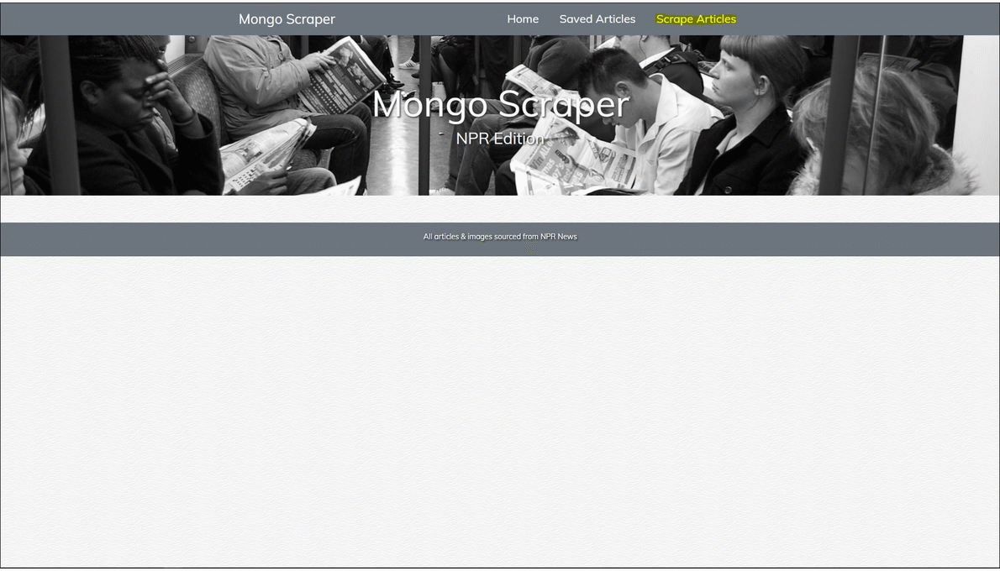

# AllTheNews
This is a front end MongoDB Scraper application built with Bootstrap, Node, Express, & Handlebars for dynamic responsiveness, and deployed on Heroku.

# How to use
From the Mongo Scraper NPR Edition Home page, users click 'Scrape Articles' in the top right navigation bar.  21 articles from different areas of NPR News will then display, allowing users to click the title, text, or image in each article to open the coresponding NPR News site.  Users can also click the 'Save Article' button to save for later reading.  From the 'Saved Articles' link in the navigation bar, users are brought to their saved articles.  From there they can click 'Comment' to add comments to the article, 'Delete' to remove comments, or 'Remove Article' from their Saved page.  Again, users can click the title, text, and image, to be brought to the NPR News story.

### [Try the App!](https://obscure-wildwood-64505.herokuapp.com/)

Technology: HTML5 | CSS3 | Bootstrap | JavaScript | Jquery | Google Fonts | Express | Node | MongoDB | Handlebars | Mongoose